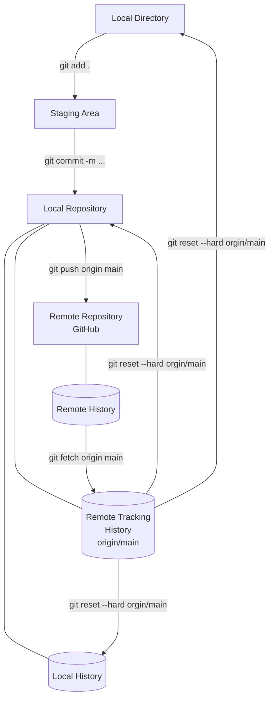

# Git Commands Practice

## Git Commands

1. `git fetch` or `git fetch origin main`
2. `git reset --soft origin/main`
3. `git reset --mixed origin/main`
4. `git reset --hard origin/main`
5. `git pull` or `git pull origin main`
6. `git checkout -b <branch_name>`
7. `git checkout <branch_name>`
8. `git branch -M <branch_name>`
9. `git restore <file_path>` 
10. `git restore --staged <file_path>`
11. `git merge`

